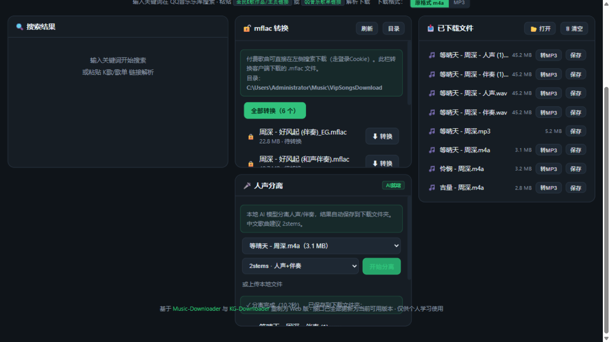
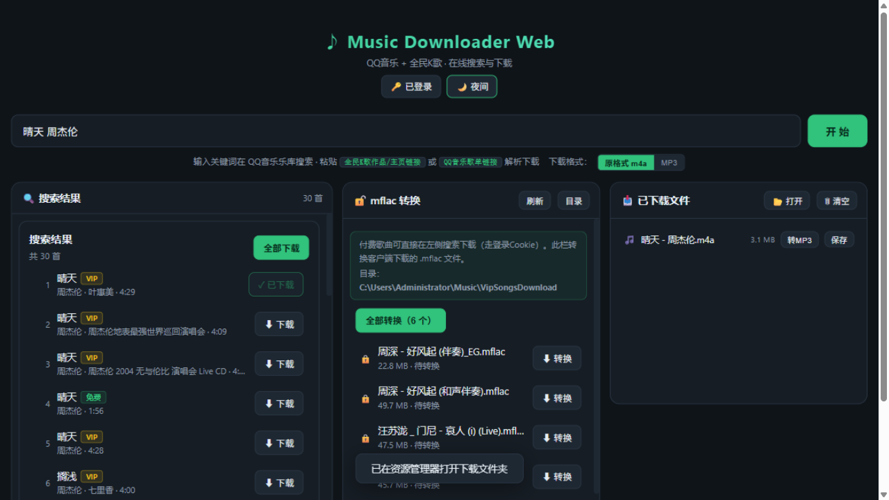

# Music Downloader Web

🎵 一站式音乐工具：**QQ音乐搜索/下载（标准·HQ·SQ无损·臻品母带四档音质）+ 全民K歌下载 + mflac解密 + 本地AI人声分离**，纯本地运行的 Web 应用。

基于 [Music-Downloader](https://github.com/Li4n0/Music-Downloader) 与 [KG-Downloader](https://github.com/T-K-233/KG-Downloader) 重制，接口全部更新为当前可用版本。




## ✨ 功能

| 功能 | 说明 |
|------|------|
| QQ音乐搜索 | 关键词搜索乐库，免费/VIP 标记 |
| **四档音质下载** | 标准128k / HQ 320k / **SQ无损(默认)** / 臻品母带，自动降级 |
| QQ音乐歌单 | 粘贴歌单链接，批量下载全部歌曲 |
| 全民K歌 | 作品/主页链接解析下载（支持新旧链接格式） |
| mflac 解密 | 客户端下载的加密 mflac 转可用 flac（Unlock Music WASM） |
| 人声分离 | 本地 AI 模型分离人声/伴奏（2/4/5 分轨，需 vocal-separate 工具） |
| 格式转换 | ffmpeg 转换 MP3，文件一键转换 |
| 界面 | 三栏布局 · 夜间/日间主题 · 下载文件夹一键打开/清空 |

## 🚀 快速开始（普通用户）

1. 到 [Releases](../../releases) 下载 `MusicDownloaderWeb.exe`（单文件，内置全部依赖）
2. 双击运行，等待自检完成，浏览器自动打开 `http://127.0.0.1:8899`
3. 点右上角「🔑 登录设置」，粘贴你自己的 QQ音乐 Cookie（见下方说明）

> 首次启动需解包内置依赖，约 10~20 秒属正常现象。

### Cookie 获取方法（必需）

QQ音乐搜索与高品质下载需要登录态：

1. 浏览器打开并登录 [y.qq.com](https://y.qq.com)
2. 按 `F12` → 「网络」或「应用」→ 找到 Cookie → 全选复制
3. 粘贴到页面右上角「登录设置」→ 保存

Cookie 只保存在你自己电脑上，不会上传到任何地方。

## 🔧 源码运行（开发者）

```bash
git clone https://github.com/MeowAndy/Music-Downloader-Web.git
cd Music-Downloader-Web
pip install flask requests
# 放入 node.exe 和 ffmpeg.exe 到 bin/ 目录（歌单/转换功能需要）
python selftest.py   # 一键启动 + 13项自测
```

## 📦 打包 EXE

```bash
pip install pyinstaller
# bin/ 下需有 node.exe、ffmpeg.exe
pyinstaller --onefile --name MusicDownloaderWeb ^
  --add-data "static;static" --add-data "vendor;vendor" --add-data "bin;bin" ^
  app.py
```

## 🏗️ 技术架构

```
app.py            Flask 主应用（端口 8899）
paths.py          路径解析（源码/打包双模式）
qq_api.py         QQ音乐：搜索 / 四档音质 vkey / 歌单
kg_api.py         全民K歌：单曲 / 主页解析
vip_api.py        mflac 手动转换
vocal_api.py      人声分离（调用本地 vocal-separate）
ffmpeg_api.py     格式转换
vendor/
  node_bridge.js      Flask ↔ Node 桥接（歌单走签名加密通道）
  new_sign_module.js  y.qq.com 官方签名模块提取版
  um/um_decrypt.js    Unlock Music WASM 解密（mflac→flac）
static/index.html 前端（单文件，无框架）
```

- **音质原理**：vkey 接口按 `media_mid` + 音质前缀构造文件名（`F000`=SQ flac、`M800`=HQ mp3、`AI00`=母带），带 VIP Cookie 可获取无损直链
- **歌单原理**：官方网页改用带签名+加密的 `musics.fcg` 通道，签名模块从官方 JS 提取后在 Node 中运行
- **人声分离**：调用 [vocal-separate](https://github.com/jianchang512/vocal-separate) 工具（需自行下载放到程序旁 `vocal-separate/` 目录，或默认 E 盘路径），未安装时该面板自动降级

## ⚠️ 免责声明

- 本项目仅供**个人学习交流**使用，请勿用于商业用途
- 音乐版权归原作者及平台所有，下载内容请在授权范围内使用
- VIP 音质下载需要你自己的有效会员账号，本工具不绕过任何付费授权
- `vendor/` 内含第三方组件（Unlock Music 等），其版权归原项目所有

## 🙏 致谢

- [Li4n0/Music-Downloader](https://github.com/Li4n0/Music-Downloader) — 原始项目灵感
- [T-K-233/KG-Downloader](https://github.com/T-K-233/KG-Downloader) — K歌解析参考
- [jianchang512/vocal-separate](https://github.com/jianchang512/vocal-separate) — 人声分离
- [Unlock Music](https://git.unlock-music.dev/um/web) — mflac 解密
